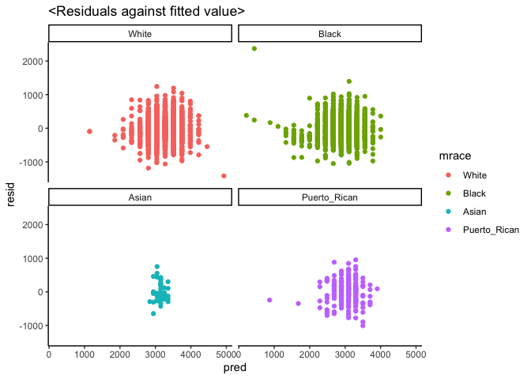
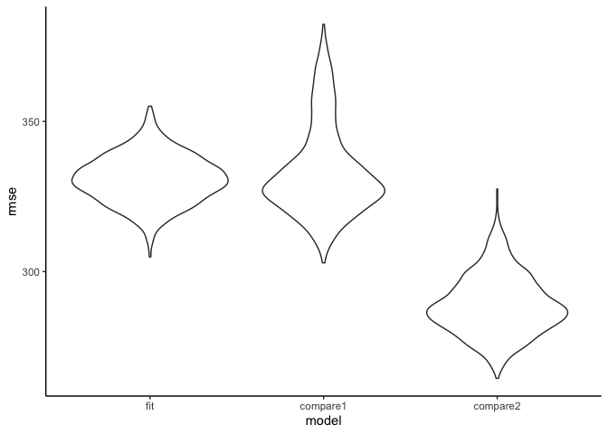
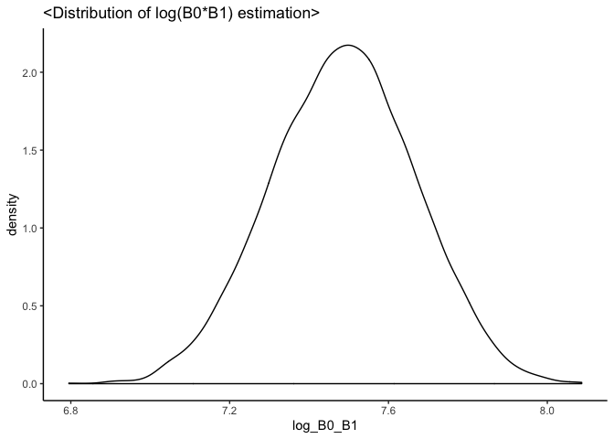

HW6
================
Seonyoung Park (sp3804)
12/4/2020

``` r
library(tidyverse)
```

    ## ── Attaching packages ───────────────────────────────────────────────────────── tidyverse 1.3.0 ──

    ## ✓ ggplot2 3.2.1     ✓ purrr   0.3.4
    ## ✓ tibble  3.0.1     ✓ dplyr   1.0.2
    ## ✓ tidyr   1.0.2     ✓ stringr 1.4.0
    ## ✓ readr   1.3.1     ✓ forcats 0.4.0

    ## ── Conflicts ──────────────────────────────────────────────────────────── tidyverse_conflicts() ──
    ## x dplyr::filter() masks stats::filter()
    ## x dplyr::lag()    masks stats::lag()

``` r
library(dplyr)
library(ggplot2)
library(labelled)
library(modelr)
```

## Problem 1

``` r
homicide_df = read_csv("./homicide-data.csv", na=c("", "NA", "Unknown"))%>%
  mutate(
    city_state=str_c(city,state, sep="_"),
    victim_age = as.numeric(victim_age),
    resolution=case_when(
      disposition=="Closed without arrest"~0,
      disposition=="Open/No arrest"~0,
      disposition=="Closed by arrest"~1,
    )
  ) %>%
  filter(
    city_state !="Tulsa_AL") %>%
  select(city_state, resolution, victim_age, victim_race, victim_sex)
```

    ## Parsed with column specification:
    ## cols(
    ##   uid = col_character(),
    ##   reported_date = col_double(),
    ##   victim_last = col_character(),
    ##   victim_first = col_character(),
    ##   victim_race = col_character(),
    ##   victim_age = col_double(),
    ##   victim_sex = col_character(),
    ##   city = col_character(),
    ##   state = col_character(),
    ##   lat = col_double(),
    ##   lon = col_double(),
    ##   disposition = col_character()
    ## )

Starts with one city

``` r
baltimore_df = homicide_df %>%
  filter(city_state=="Baltimore_MD")

glm(resolution ~ victim_age + victim_race + victim_sex, data=baltimore_df,
    family = binomial()) %>%
  broom::tidy() %>%
  mutate(
    OR = exp(estimate),
    CI_lower=exp(estimate-1.96*std.error),
    CI_upper=exp(estimate+1.96*std.error)
  ) %>%
  select(term,OR,starts_with("CI")) %>%
  knitr::kable(digits=3)
```

| term                 |    OR | CI\_lower | CI\_upper |
| :------------------- | ----: | --------: | --------: |
| (Intercept)          | 4.421 |     1.212 |    16.131 |
| victim\_age          | 0.993 |     0.986 |     0.999 |
| victim\_raceBlack    | 0.320 |     0.091 |     1.125 |
| victim\_raceHispanic | 0.570 |     0.147 |     2.219 |
| victim\_raceOther    | 0.345 |     0.042 |     2.849 |
| victim\_raceWhite    | 0.744 |     0.204 |     2.712 |
| victim\_sexMale      | 0.415 |     0.318 |     0.542 |

Try this across cities

``` r
a= na.omit(homicide_df) %>%
  nest(data= -city_state)

models_results_df = a %>%
  mutate(
    models = 
      map(.x=data, ~glm(resolution ~victim_age + victim_race + victim_sex, data = .x, family = binomial(logit))),
    results = map(models, broom::tidy)
  ) %>%
    select(city_state, results) %>%
    unnest(results) %>%
    mutate(
      OR = exp(estimate),
      CI_lower = exp(estimate-1.96*std.error),
      CI_upper = exp(estimate+1.96*std.error)
    ) %>%
    select(city_state, term, OR, starts_with("CI"))
```

Finally, I make a plot showing the estimates (and CI) of the proportion
of unsolved homicides in each city

``` r
models_results_df %>%
  filter(term == "victim_sexMale") %>%
  mutate(city_state = fct_reorder(city_state, OR)) %>%
  ggplot(aes(x=city_state, y=OR)) +
  geom_point() +
  geom_errorbar(aes(ymin=CI_lower, ymax=CI_upper)) +
  theme(axis.text.x=element_text(angle=90, hjust=1))
```

<!-- -->

## Problem 2

### Approach

  - Find some residuals
  - residual plot; geom\_density()

<!-- end list -->

``` r
birthweight = read.csv("birthweight.csv")
glimpse(birthweight)
```

    ## Rows: 4,342
    ## Columns: 20
    ## $ babysex  <int> 2, 1, 2, 1, 2, 1, 2, 2, 1, 1, 2, 1, 2, 1, 1, 2, 1, 2, 2, 2, …
    ## $ bhead    <int> 34, 34, 36, 34, 34, 33, 33, 33, 36, 33, 35, 35, 35, 36, 35, …
    ## $ blength  <int> 51, 48, 50, 52, 52, 52, 46, 49, 52, 50, 51, 51, 48, 53, 51, …
    ## $ bwt      <int> 3629, 3062, 3345, 3062, 3374, 3374, 2523, 2778, 3515, 3459, …
    ## $ delwt    <int> 177, 156, 148, 157, 156, 129, 126, 140, 146, 169, 130, 146, …
    ## $ fincome  <int> 35, 65, 85, 55, 5, 55, 96, 5, 85, 75, 55, 55, 75, 75, 65, 75…
    ## $ frace    <int> 1, 2, 1, 1, 1, 1, 2, 1, 1, 2, 1, 1, 1, 1, 1, 2, 1, 1, 1, 2, …
    ## $ gaweeks  <dbl> 39.9, 25.9, 39.9, 40.0, 41.6, 40.7, 40.3, 37.4, 40.3, 40.7, …
    ## $ malform  <int> 0, 0, 0, 0, 0, 0, 0, 0, 0, 0, 0, 0, 0, 0, 0, 0, 0, 0, 0, 0, …
    ## $ menarche <int> 13, 14, 12, 14, 13, 12, 14, 12, 11, 12, 13, 12, 13, 11, 12, …
    ## $ mheight  <int> 63, 65, 64, 64, 66, 66, 72, 62, 61, 64, 67, 62, 64, 68, 62, …
    ## $ momage   <int> 36, 25, 29, 18, 20, 23, 29, 19, 13, 19, 23, 16, 28, 23, 21, …
    ## $ mrace    <int> 1, 2, 1, 1, 1, 1, 2, 1, 1, 2, 1, 1, 1, 1, 1, 2, 1, 1, 1, 2, …
    ## $ parity   <int> 3, 0, 0, 0, 0, 0, 0, 0, 0, 0, 0, 0, 0, 0, 0, 0, 0, 0, 0, 0, …
    ## $ pnumlbw  <int> 0, 0, 0, 0, 0, 0, 0, 0, 0, 0, 0, 0, 0, 0, 0, 0, 0, 0, 0, 0, …
    ## $ pnumsga  <int> 0, 0, 0, 0, 0, 0, 0, 0, 0, 0, 0, 0, 0, 0, 0, 0, 0, 0, 0, 0, …
    ## $ ppbmi    <dbl> 26.27184, 21.34485, 23.56517, 21.84508, 21.02642, 18.60030, …
    ## $ ppwt     <int> 148, 128, 137, 127, 130, 115, 105, 119, 105, 145, 110, 115, …
    ## $ smoken   <dbl> 0.000, 0.000, 1.000, 10.000, 1.000, 0.000, 0.000, 0.000, 0.0…
    ## $ wtgain   <int> 29, 28, 11, 30, 26, 14, 21, 21, 41, 24, 20, 31, 23, 21, 24, …

``` r
birthweight = birthweight %>%
  set_value_labels(
    babysex=c(male=1, female=2),
    mrace=c(White=1, Black=2, Asian=3, Puerto_Rican=4, Other=8),
    frace=c(White=1, Black=2, Asian=3, Puerto_Rican=4, Other=8),
    malform=c(absent=0, present=1)
  ) %>%
  mutate_if(is.labelled, to_factor)

birthweight = birthweight %>%
  mutate(birth_order = parity+1)
birthweight = birthweight %>%
  mutate(birth_order=as.integer(birth_order))
```

### Propose a regression model for birthweight

Here we hypothesized baby’s head circumstance at birth (centimeters) is
significantly associated with baby’s birth weight, and maternal
demographic features might work as effect modificators. Through forward
step approach, the best prospective EMM covariate is chosen.

After comparing the impact of covariate to change the bhead estimate and
R-square of the model, maternal race is chosen and included into the
model as interaction terms.

``` r
fit1 = lm(bwt ~bhead, data=birthweight)
summary(fit1)  
```

    ## 
    ## Call:
    ## lm(formula = bwt ~ bhead, data = birthweight)
    ## 
    ## Residuals:
    ##      Min       1Q   Median       3Q      Max 
    ## -1334.60  -229.95   -12.73   224.05  2443.47 
    ## 
    ## Coefficients:
    ##              Estimate Std. Error t value Pr(>|t|)    
    ## (Intercept) -4830.866    107.427  -44.97   <2e-16 ***
    ## bhead         236.109      3.189   74.05   <2e-16 ***
    ## ---
    ## Signif. codes:  0 '***' 0.001 '**' 0.01 '*' 0.05 '.' 0.1 ' ' 1
    ## 
    ## Residual standard error: 340.5 on 4340 degrees of freedom
    ## Multiple R-squared:  0.5582, Adjusted R-squared:  0.5581 
    ## F-statistic:  5483 on 1 and 4340 DF,  p-value: < 2.2e-16

``` r
fit2 = lm(bwt ~bhead*mrace, data=birthweight)
summary(fit2)  
```

    ## 
    ## Call:
    ## lm(formula = bwt ~ bhead * mrace, data = birthweight)
    ## 
    ## Residuals:
    ##      Min       1Q   Median       3Q      Max 
    ## -1417.03  -224.60   -14.56   220.85  2370.15 
    ## 
    ## Coefficients:
    ##                          Estimate Std. Error t value Pr(>|t|)    
    ## (Intercept)             -4775.777    168.810 -28.291  < 2e-16 ***
    ## bhead                     236.776      4.965  47.685  < 2e-16 ***
    ## mraceBlack                307.136    222.827   1.378  0.16816    
    ## mraceAsian               4423.987   1417.352   3.121  0.00181 ** 
    ## mracePuerto_Rican         988.542    468.224   2.111  0.03481 *  
    ## bhead:mraceBlack          -13.799      6.612  -2.087  0.03694 *  
    ## bhead:mraceAsian         -133.788     41.773  -3.203  0.00137 ** 
    ## bhead:mracePuerto_Rican   -34.323     13.829  -2.482  0.01310 *  
    ## ---
    ## Signif. codes:  0 '***' 0.001 '**' 0.01 '*' 0.05 '.' 0.1 ' ' 1
    ## 
    ## Residual standard error: 330.8 on 4334 degrees of freedom
    ## Multiple R-squared:  0.5834, Adjusted R-squared:  0.5827 
    ## F-statistic: 866.9 on 7 and 4334 DF,  p-value: < 2.2e-16

``` r
fit3 = lm(bwt ~bhead*momage, data=birthweight)
summary(fit3)  
```

    ## 
    ## Call:
    ## lm(formula = bwt ~ bhead * momage, data = birthweight)
    ## 
    ## Residuals:
    ##      Min       1Q   Median       3Q      Max 
    ## -1341.64  -229.11    -9.75   223.34  2425.98 
    ## 
    ## Coefficients:
    ##                Estimate Std. Error t value Pr(>|t|)    
    ## (Intercept)  -4523.4613   588.6824  -7.684 1.89e-14 ***
    ## bhead          222.5712    17.4429  12.760  < 2e-16 ***
    ## momage         -12.3992    29.1383  -0.426    0.670    
    ## bhead:momage     0.5848     0.8617   0.679    0.497    
    ## ---
    ## Signif. codes:  0 '***' 0.001 '**' 0.01 '*' 0.05 '.' 0.1 ' ' 1
    ## 
    ## Residual standard error: 339.3 on 4338 degrees of freedom
    ## Multiple R-squared:  0.5613, Adjusted R-squared:  0.561 
    ## F-statistic:  1850 on 3 and 4338 DF,  p-value: < 2.2e-16

``` r
fit4 = lm(bwt ~bhead*fincome, data=birthweight)
summary(fit4)  
```

    ## 
    ## Call:
    ## lm(formula = bwt ~ bhead * fincome, data = birthweight)
    ## 
    ## Residuals:
    ##      Min       1Q   Median       3Q      Max 
    ## -1275.30  -230.12    -8.08   225.13  2417.81 
    ## 
    ## Coefficients:
    ##                 Estimate Std. Error t value Pr(>|t|)    
    ## (Intercept)   -4631.7205   203.8839 -22.717   <2e-16 ***
    ## bhead           228.4018     6.0711  37.621   <2e-16 ***
    ## fincome          -3.0043     4.3545  -0.690    0.490    
    ## bhead:fincome     0.1294     0.1290   1.004    0.316    
    ## ---
    ## Signif. codes:  0 '***' 0.001 '**' 0.01 '*' 0.05 '.' 0.1 ' ' 1
    ## 
    ## Residual standard error: 338.7 on 4338 degrees of freedom
    ## Multiple R-squared:  0.563,  Adjusted R-squared:  0.5627 
    ## F-statistic:  1863 on 3 and 4338 DF,  p-value: < 2.2e-16

``` r
fit_final = lm(bwt ~bhead*mrace, data=birthweight)

broom::tidy(fit_final) %>%
  select(-std.error, -statistic) %>%
  knitr::kable()
```

| term                     |     estimate |   p.value |
| :----------------------- | -----------: | --------: |
| (Intercept)              | \-4775.77654 | 0.0000000 |
| bhead                    |    236.77587 | 0.0000000 |
| mraceBlack               |    307.13575 | 0.1681627 |
| mraceAsian               |   4423.98707 | 0.0018124 |
| mracePuerto\_Rican       |    988.54230 | 0.0348073 |
| bhead:mraceBlack         |   \-13.79903 | 0.0369403 |
| bhead:mraceAsian         |  \-133.78757 | 0.0013712 |
| bhead:mracePuerto\_Rican |   \-34.32294 | 0.0131022 |

### Diagnostics

When we plot the residual along each maternal race category, we may
notice the residual is highly skewed for “Black” race category.

Plot the residuals along fitted value

  - The residual distribution along fitted value is centered around
    zero.
  - Among maternal race category, the residual of Black category is a
    little left-skewed.

<!-- end list -->

``` r
birthweight %>%
  ggplot(aes(x=pred, y=resid, color=mrace)) +
  geom_point() +labs(title = "<Residuals against fitted value>") + facet_wrap("mrace")+
  theme_classic()
```

<!-- -->

``` r
birthweight %>%
  ggplot(aes(x=pred, y=resid, color=mrace)) +
  geom_point() +labs(title = "<Residuals against fitted value>") +
  theme_classic()
```

<!-- -->

### Compare your model to two others:

  - compare1: One using length at birth and gestational age as
    predictors (main effects only)
  - compare2: One using head circumference, length, sex, and all
    interactions (including the three-way interaction) between these

<!-- end list -->

``` r
compare1 = lm(bwt ~blength+gaweeks, data=birthweight)
summary(compare1)  
```

    ## 
    ## Call:
    ## lm(formula = bwt ~ blength + gaweeks, data = birthweight)
    ## 
    ## Residuals:
    ##     Min      1Q  Median      3Q     Max 
    ## -1709.6  -215.4   -11.4   208.2  4188.8 
    ## 
    ## Coefficients:
    ##              Estimate Std. Error t value Pr(>|t|)    
    ## (Intercept) -4347.667     97.958  -44.38   <2e-16 ***
    ## blength       128.556      1.990   64.60   <2e-16 ***
    ## gaweeks        27.047      1.718   15.74   <2e-16 ***
    ## ---
    ## Signif. codes:  0 '***' 0.001 '**' 0.01 '*' 0.05 '.' 0.1 ' ' 1
    ## 
    ## Residual standard error: 333.2 on 4339 degrees of freedom
    ## Multiple R-squared:  0.5769, Adjusted R-squared:  0.5767 
    ## F-statistic:  2958 on 2 and 4339 DF,  p-value: < 2.2e-16

``` r
compare2 = lm(bwt ~bhead*blength*babysex, data=birthweight)
summary(compare2)  
```

    ## 
    ## Call:
    ## lm(formula = bwt ~ bhead * blength * babysex, data = birthweight)
    ## 
    ## Residuals:
    ##      Min       1Q   Median       3Q      Max 
    ## -1132.99  -190.42   -10.33   178.63  2617.96 
    ## 
    ## Coefficients:
    ##                               Estimate Std. Error t value Pr(>|t|)    
    ## (Intercept)                 -7176.8170  1264.8397  -5.674 1.49e-08 ***
    ## bhead                         181.7956    38.0542   4.777 1.84e-06 ***
    ## blength                       102.1269    26.2118   3.896 9.92e-05 ***
    ## babysexfemale                6374.8684  1677.7669   3.800 0.000147 ***
    ## bhead:blength                  -0.5536     0.7802  -0.710 0.478012    
    ## bhead:babysexfemale          -198.3932    51.0917  -3.883 0.000105 ***
    ## blength:babysexfemale        -123.7729    35.1185  -3.524 0.000429 ***
    ## bhead:blength:babysexfemale     3.8781     1.0566   3.670 0.000245 ***
    ## ---
    ## Signif. codes:  0 '***' 0.001 '**' 0.01 '*' 0.05 '.' 0.1 ' ' 1
    ## 
    ## Residual standard error: 287.7 on 4334 degrees of freedom
    ## Multiple R-squared:  0.6849, Adjusted R-squared:  0.6844 
    ## F-statistic:  1346 on 7 and 4334 DF,  p-value: < 2.2e-16

Cross validation using ‘modelr’

  - fit\_final= lm(bwt ~bhead\*mrace, data=birthweight)
  - compare1= lm(bwt ~blength+gaweeks, data=birthweight)
  - compare2= lm(bwt ~bhead*blength*babysex, data=birthweight)

<!-- end list -->

``` r
cv_df =
  crossv_mc(birthweight, 1000) %>% 
  mutate(
    train = map(train, as_tibble),
    test = map(test, as_tibble))

cv_df = 
  cv_df %>% 
  mutate(
    fit  = map(train, ~lm(bwt ~bhead*mrace, data = .x)),
    compare1 = map(train, ~lm(bwt ~blength+gaweeks, data = .x)),
    compare2 = map(train, ~lm(bwt ~bhead*blength*babysex, data = .x))) %>% 
  mutate(
    rmse_fit = map2_dbl(fit, test, ~rmse(model = .x, data = .y)),
    rmse_compare1    = map2_dbl(compare1, test, ~rmse(model = .x, data = .y)),
    rmse_compare2 = map2_dbl(compare2, test, ~rmse(model = .x, data = .y)))
```

Finally, I’ll plot the prediction error distribution for each candidate
model. By comparing the prediction error, what seems to be winner is the
compare2 model using head circumference, length, sex, and all
interactions (including the three-way interaction) between these.

``` r
cv_df %>% 
  select(starts_with("rmse")) %>% 
  pivot_longer(
    everything(),
    names_to = "model", 
    values_to = "rmse",
    names_prefix = "rmse_") %>% 
  mutate(model = fct_inorder(model)) %>% 
  ggplot(aes(x = model, y = rmse)) + geom_violin() +theme_classic()
```

<!-- -->

## Problem 3

### Data loading

``` r
weather_df = 
  rnoaa::meteo_pull_monitors(
    c("USW00094728"),
    var = c("PRCP", "TMIN", "TMAX"), 
    date_min = "2017-01-01",
    date_max = "2017-12-31") %>%
  mutate(
    name = recode(id, USW00094728 = "CentralPark_NY"),
    tmin = tmin / 10,
    tmax = tmax / 10) %>%
  select(name, id, everything())
```

    ## Registered S3 method overwritten by 'hoardr':
    ##   method           from
    ##   print.cache_info httr

    ## using cached file: /Users/shannon/Library/Caches/R/noaa_ghcnd/USW00094728.dly

    ## date created (size, mb): 2020-12-04 18:19:30 (7.534)

    ## file min/max dates: 1869-01-01 / 2020-12-31

### linear model

``` r
temp_model = lm(tmax ~tmin, data=weather_df)

broom::glance(temp_model)
```

    ## # A tibble: 1 x 12
    ##   r.squared adj.r.squared sigma statistic   p.value    df logLik   AIC   BIC
    ##       <dbl>         <dbl> <dbl>     <dbl>     <dbl> <dbl>  <dbl> <dbl> <dbl>
    ## 1     0.912         0.911  2.94     3741. 2.98e-193     1  -910. 1827. 1838.
    ## # … with 3 more variables: deviance <dbl>, df.residual <int>, nobs <int>

``` r
beta = broom::tidy(temp_model) %>%
  select(term,estimate) %>%
  set_value_labels(term=c(Beta0="(Intercept)", Beta1="tmin"))%>%
  mutate_if(is.labelled,to_factor) %>%
  pivot_wider(
    names_from = term,
    values_from = estimate
  ) 
```

### Bootstrap

``` r
boot_straps= weather_df %>% 
  modelr::bootstrap(n = 5000) %>% 
  mutate(
    temp_model = map(strap, ~lm(tmax ~tmin, data=.x)),
    results = map(temp_model, broom::tidy),
    summary= map(temp_model, broom::glance)
    ) 
```

### Plot the distribution of your estimates, and describe these in words.

  - R^2 estimate is almost normally distributed, even though having
    slight tail extending to low values and a bit of a “shoulder”
  - log(B0\*B1) estimate is almost normally distributed.

<!-- end list -->

``` r
boot_straps %>% 
  select(-strap, -.id, -temp_model) %>% 
  unnest(summary) %>%
  ggplot(aes(x = r.squared)) + geom_density() +theme_classic()+
  labs(title="<Distribution of R^2 estimation>")
```

<!-- -->

``` r
boot_straps %>% 
  select(-strap, -.id, -temp_model) %>% 
  unnest(results) %>% 
  select(term,estimate) %>%
  set_value_labels(term=c(Beta0="(Intercept)", Beta1="tmin"))%>%
  mutate_if(is.labelled,to_factor) %>%
  pivot_wider(
    names_from = term,
    values_from = estimate
  )%>%
  unnest() %>%
  mutate(
    log_B0_B1 = Beta0*Beta1
  )%>%
  ggplot(aes(x = log_B0_B1)) + geom_density() +theme_classic()+ labs(title="<Distribution of log(B0*B1) estimation>")
```

    ## Warning: Values in `estimate` are not uniquely identified; output will contain list-cols.
    ## * Use `values_fn = list(estimate = list)` to suppress this warning.
    ## * Use `values_fn = list(estimate = length)` to identify where the duplicates arise
    ## * Use `values_fn = list(estimate = summary_fun)` to summarise duplicates

    ## Warning: `cols` is now required.
    ## Please use `cols = c(Beta0, Beta1)`

<!-- -->

### 95% CI for R^2

``` r
boot_straps %>% 
  select(-strap, -.id, -temp_model) %>% 
  unnest(summary) %>% 
  summarize(
    R2_CI_low = quantile(r.squared, 0.025),
    R2_CI_upper = quantile(r.squared, 0.975)
  )
```

    ## # A tibble: 1 x 2
    ##   R2_CI_low R2_CI_upper
    ##       <dbl>       <dbl>
    ## 1     0.894       0.928

### 95% CI for log(B0\*B1)

``` r
boot_straps %>% 
  select(-strap, -.id, -temp_model) %>% 
  unnest(results) %>% 
  select(term,estimate) %>%
  set_value_labels(term=c(Beta0="(Intercept)", Beta1="tmin"))%>%
  mutate_if(is.labelled,to_factor) %>%
  pivot_wider(
    names_from = term,
    values_from = estimate
  ) %>%
  unnest() %>%
  mutate(
    log_B0_B1 = Beta0*Beta1
  ) %>%
  summarize(
    CI_low = quantile(log_B0_B1, 0.025),
    CI_upper = quantile(log_B0_B1, 0.975),

  )
```

    ## Warning: Values in `estimate` are not uniquely identified; output will contain list-cols.
    ## * Use `values_fn = list(estimate = list)` to suppress this warning.
    ## * Use `values_fn = list(estimate = length)` to identify where the duplicates arise
    ## * Use `values_fn = list(estimate = summary_fun)` to summarise duplicates

    ## Warning: `cols` is now required.
    ## Please use `cols = c(Beta0, Beta1)`

    ## # A tibble: 1 x 2
    ##   CI_low CI_upper
    ##    <dbl>    <dbl>
    ## 1   7.13     7.83
